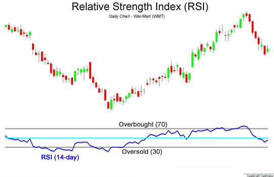
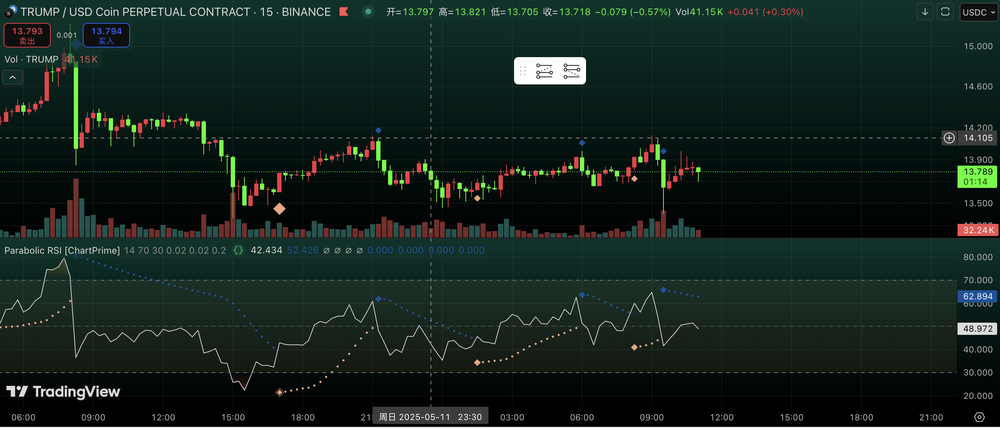

# RSI（Relative Strength Index,相对强弱指数）

## RSI简介
RSI是在1978年6月由美国机械工程师J·威列斯·威尔德提出的技术分析方法，发表在美国《Commodities》杂志中（现为《Futures》杂志），并收录于同年推出的《New Concepts in Technical Trading Systems》书中。相比起其他分析工具，RSI是其中一种较容易向大众解释的指标。民间接受度较高。

RSI是一种动量指标，用于衡量价格的相对强度。它通过计算价格的上升幅度与下降幅度之间的比率来计算。RSI通常用于识别价格的超买和超卖信号。

## RSI计算公式
RSI的计算公式如下：
RS = EMA(Up, n) / EMA(Down, n),其中：

Up = 当日收盘价 - 前一日收盘价

Down = 前一日收盘价 - 当日收盘价

EMA是指数移动平均线，n是计算RSI的周期数。通常n取14。

EMA的计算公式如下：

$$EMA = (Close - EMA(Close, n-1)) * 2 / (n + 1) + EMA(Close, n-1)$$

$$RSI = 100 - (100 / (1 + RS))$$

## RSI的应用

以RSI之高低来决定买卖时机是根据 **“涨久必跌，跌久必涨**” 的原则。以RSI作为买卖研判时，通常会设定区域界线。

>RSI的取值范围为0到100。当RSI的值低于30时，表示价格处于超卖状态，可能会出现下跌。当RSI的值高于70时，表示价格处于超买状态，可能会出现上涨。当RSI的值接近50时，表示价格处于相对均衡状态。

    

可以看到，图表显示，70的阈值代表超买信号，此时股价可能会出现下跌。30的阈值代表超卖信号，此时股价可能会出现上涨。

RSI的优点是简单易用，容易解释。但是，RSI也存在一些缺点。例如，RSI的灵敏度较高，容易受到短期价格波动的影响。此外，RSI的计算方法也存在一些问题，可能会导致一些错误的信号。因此，在使用RSI时，需要根据具体情况进行调整。

## RSI的衍生指标

RSI还有一些衍生指标，例如在tradingView中，RSI本身的图表中，还附带了一条RSI based-MA线，用于辅助判断。RSI based-MA线是RSI的移动平均线，通常取14天。RSI based-MA线的作用是平滑RSI的值，以便更好地观察RSI的变化。
RSI based-MA线的计算，理论上能够起到平滑作用的算法都可以套用进去，可选的叠加计算方式有几下几种：
1. 简单移动平均线（SMA）
2. 指数移动平均线（EMA）
3. 加权移动平均线（WMA）
4. SMA叠加布林带
5. 平滑移动平均线 SMMA（RMA）
6. 成交量加权移动平均线（VWMA）

> 什么是成交量加权移动平均线？
> 与仅考虑定价数据的简单移动平均线（SMA）和指数移动平均线（EMA）不同，交易量加权移动平均线将交易量数据纳入MA计算中。它计算资产在指定时间段内的平均定价，根据其相应的交易量对每个数据点进行加权，这意味着交易活动较高的时期对 MA 值的影响更大。例如，如果周期第三天的交易量高于其他几天，则收盘价对平均值的影响更大。
> 旨在提供更准确的市场趋势图景，因为交易量较高的时期在市场情绪方面被认为更重要。
> VWMA公式如下：VWMA = （收盘价 x 交易量）总和 / 交易量总和

以上六种在tradingView中都可以找到，具体可以自行搜索。

 7. 抛物线RSI指标

衍生指标中，我还想介绍一类独特的异化RSI指标，名为抛物线RSI指标。

抛物线RSI指标将抛物线转向指标 (SAR)直接应用于相对强弱指数 (RSI) 。这种组合有助于交易者在 RSI 框架内识别趋势转变和潜在反转点。该指标根据抛物线转向指标是否突破或跌破关键 RSI 阈值， 提供常规信号和强信号。

感谢TradingView社区提供的开源代码，这里我提供了分步骤的中文注释，源代码详见 [Parabolic RSI](抛物线RSI.pine)。感谢开发者【ChartPrime】提供的开源代码。

这里我给出代码使用的一个实例：

    

直接说明最简单易懂的一个信号标志，绘制在主图上的：

大菱形（强信号）——当抛物线转向指标 (SAR) 突破 70 RSI 或低于 30 RSI 时出现，表示可能出现逆转。

小菱形（常规信号）——当抛物线转向指标 (SAR) 在 RSI 范围内翻转时出现，表示趋势转变较弱。

如何使用：

当 SAR 反转至 70 RSI 以上（超买）或 30 RSI 以下（超卖）时，寻找强信号（大菱形），以了解潜在的逆转。
使用常规信号（小菱形）来表示 RSI 范围内的微小趋势转变。
结合价格行为和其他指标来确认进入点和退出点。
根据市场情况调整 SAR 加速因子以微调敏感度。