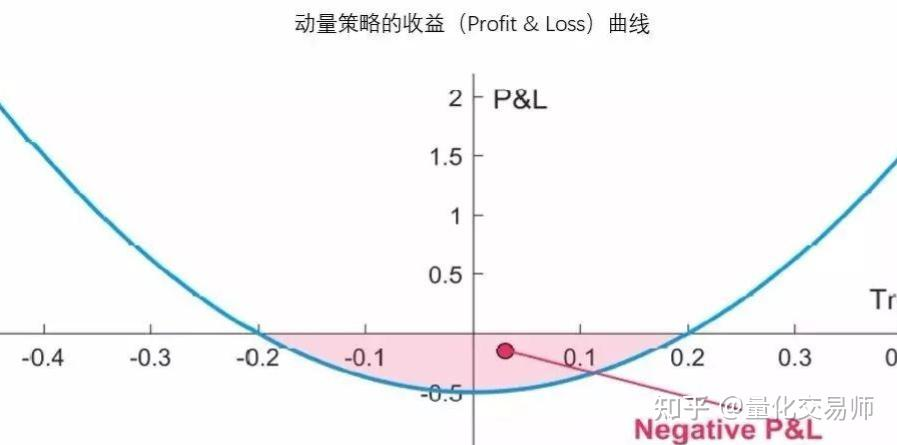

# 动量策略 - 连续开单

## 策略思路

动量策略是讨厌波动的，动量策略多数时候在出现趋势时能够捕捉到赚钱机会，但是在震荡市场，动量策略往往会因为扰动而错判入场，这是动量策略的一个缺点。

Jusselin et al. (2017) 指出，动量策略的收益（profit & loss）曲线是一个凸函数（下图）。当趋势很小的时候，该策略的收益为负；只有当趋势很大的时候（既可以是上涨趋势也可以是下跌趋势），该策略的收益为正。论文原文：[Understanding the Momentum Risk Premium:
An In-Depth Journey Through
Trend-Following Strategies](../../Quant-book/ssrn-3042173.pdf)

其中，策略的收益曲线为：

所以在开发综合策略时，可以在分段区间时，在趋势区间里用动量策略往往能获得不错的收益。

而动量策略为什么是一个很不错的策略呢？如图所示，他的负收益是有限的，而收益是无上限的。但是维持这种有限的亏损，有一个前提是不能在策略中配置较高的杠杆，因为动量策略，理论上是一个 **无限子弹**  的策略，只有手头一直有筹码，才能从一轮完整的趋势中获益。

也因为一点，杠杆率对策略收益和亏损的放大并不是线性的，高杠杆的风险，和投资回报不成正比。

- 聊聊双均线系统
双均线系统是一种常用的量化交易策略，它的基本思想是通过计算两条不同时间周期的移动平均线，来判断市场的趋势。

## 策略逻辑
1. 计算快慢线，建立一个双均线系统：
   - 用EMA()分别计算10天和20天的指数移动平均线，得到快线和慢线。
   - 计算快线和慢线的差值，得到动量。
2. 计算动量周期：
   - 计算动量的周期，用K线收盘价减前10天的收盘价得到动量。
3. 

## 执行策略
执行动量策略的代码，在TradingView的策略中设置0.05%的手续费，金字塔式交易每笔设置100笔订单（足够大），保证在动量策略中连续多笔开多或者开空。

