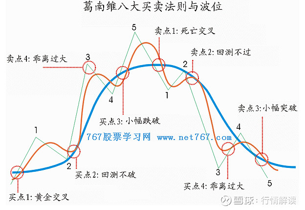

# 双均线策略

## 均线的前世今生
均线，一个进行形态分析总绕不开的指标。从时序分析讲，它只是过去某一指标连续时间序列的平均值。

均线最早由美国投资专家Joseph E.Granville(格兰威尔)于20世纪中期提出，现在仍然广泛为人们使用，成为判断买卖信号的一大重要指标。

均线能够用于预测，是因为：<u>资产的长期价格呈现均值回复的特征，即从长期来看，资产的价格会回归均值。这也是均线理论被广泛应用的前提。</u>

## 格兰维尔移动平均线八大买卖法则

1962年7月，Joseph E.Granville在他的书中提出了著名的Granville八大买卖法则【格兰维尔移动平均线八大买卖法则】。只利用股价和均线即可进行择时，方法简单有效，一经提出，迅速受到市场追捧。尤其是其中的金叉和死叉信号，更是沿用至今。Granville 八大法则其中有四条是用于判断买进时机，另外四条是用于判断卖出时机。买进和卖出法则一一对应，分布在高点的左右两侧（除买4和卖4以外）。法则内容如下所示：

- 买1：【黄金交叉】均线整体上行，股价由下至上上穿均线，此为黄金交叉，形成第一个买点。
- 买2：【回测不破】股价出现下跌迹象，但尚未跌破均线，此时均线变成支撑线，形成第二个买点。
- 买3：【小幅跌破】股价仍处于均线上方，但呈现急剧下跌趋势。当跌破均线时，出现第三个买点。
- 买4：【乖离过大】（右侧）股价和均线都处于下降通道，且股价处于均线下方，严重远离均线，出现第四个买点。

- 卖1：【死亡交叉】均线由上升状态变为缓慢下降的状态，股价也开始下降。当股价跌破均线时，此为死亡交叉，形成第一个卖点。
- 卖2：【回测不过】股价仍处于均线之下，但股价开始呈现上涨趋势，当股价无限接近均线但尚未突破时，此时均线变成阻力线，形成第二个卖点。
- 卖3：【小幅突破】股价终于突破均线，处于均线上方。但持续时间不长，股价开始下跌，直至再一次跌破均线，此为第三个卖点。
- 卖4：【乖离过大】（左侧）股价和均线都在上涨，股价上涨的速度远快于均线上涨的速度。当股价严重偏离均线时，出现第四个卖点。

* *这里图中的绿色线，其中的每个点位，换成每条K线的close收盘价即可*

**均线和股价的交叉构成了一个信号，在不同的信号下会执行对应的买入和卖出操作。**

## 双均线
双均线系统是一种常用的量化交易策略，它的基本思想是通过计算两条不同时间周期的移动平均线，来判断市场的趋势。
现在不是一条均线一条股价了，两条都是均线，交叉产生买卖信号。

